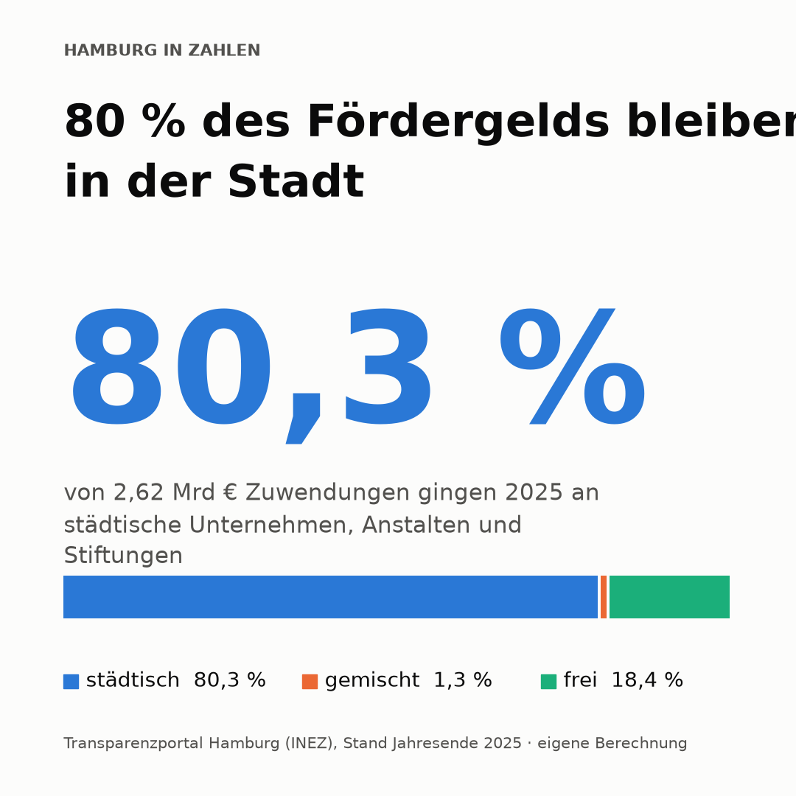

# Hamburg in Zahlen

Aus offenen Daten der Stadt Hamburg werden Instagram-Kacheln: ein Befund pro Kachel, ein Layout, ein nachvollziehbarer Weg von der Rohdatei zum Bild.
Dass diese Arbeit nötig ist, hat einen konkreten Grund. Bis 2013 bekam die Bürgerschaft vom Senat alle zwei Jahre einen fertigen Zuwendungsbericht, aufbereitet pro Empfänger. Seit dem Transparenzgesetz von 2012 stehen stattdessen alle Einzelbescheide im Transparenzportal, mehr Rohdaten als je zuvor, aber ohne Zusammenfassung. Die Auswertung, die früher die Verwaltung lieferte, muss heute jemand anderes machen. Ich sehe darin eine Aufgabe für Journalistinnen und Journalisten: Transparenz entsteht nicht durch veröffentlichte Rohdaten, sondern erst durch jemanden, der sie bereinigt, prüft und erklärt

## Die Idee

Jede Kachel zeigt einen Befund, keine Zahl. „Hamburg vergab 2025 rund 2,6 Mrd € Zuwendungen" kann jeder abschreiben. „Ein einziger Empfänger bekommt 59 % davon" ist das Ergebnis von Bereinigen, Gruppieren, Sortieren und Kumulieren. Diese Analysearbeit soll sichtbar sein: Wer die Kachel sieht, versteht den Fund in vier Sekunden. Wer ins Repo schaut, sieht den Weg dahin. 

Geplant waren vier Kacheln (Sozialwohnungen, Zuwendungen, Straßenbäume, Bäume × Sozialmonitoring). Gebaut habe ich eine: Kachel 02. Die Prüfung der Trägerschaft von 50 Empfängern hat mehr Zeit gekostet als die gesamte Analyse davor, und ich wollte lieber eine belegte Kachel als vier ungeprüfte. Die drei anderen bleiben als Ausblick stehen.

## Ergebnis: Kachel 02 · Zuwendungen



Frage: Wie verteilt sich das Fördergeld der Stadt auf die Empfänger?

Der Weg von der Datei zur Aussage, alles in `notebooks/01_zuwendungen.ipynb`:

| Schritt | Ergebnis |
|---|---|
| Rohdatei aus dem Transparenzportal | 76.961 Zeilen (einzelne Bescheide, 2015–2025) |
| Pro Vorgang nur den zeitlich letzten Bescheid behalten | 42.085 Förderfälle |
| Fördersumme minus Rückforderungen | 21,0 Mrd € netto über zehn Jahre |
| Auf Erstbescheid-Jahr 2025 eingegrenzt | 3.980 Fälle, 2,62 Mrd € |
| Sammeleintrag „Vereinsregister" aufgelöst, pro Empfänger summiert | 1.974 Empfänger |
| Schreibweisen zusammengeführt (114 Namen in 53 Gruppen) | 1.913 Empfänger |

**Erster Befund:** Die Hamburger Hochbahn AG allein erhält 59,5 %, die 20 größten Empfänger zusammen 82,5 %. Neun der zehn größten sind städtische Unternehmen und Anstalten.

**Geschärfte Frage:** Wie verteilt sich das Geld unter den nicht-städtischen Empfängern? Dafür habe ich die 50 größten Empfänger einzeln geprüft und in `data/traeger_top50.csv` eingeordnet, mit Rechtsform und Art des Nachweises je Zeile. Die Regel dahinter: Städtisch ist, wer der Stadt mehrheitlich gehört, oder wer eine Anstalt, Körperschaft oder Stiftung öffentlichen Rechts ist, deren Träger die Stadt oder eine ihrer Körperschaften ist. Selbstverwaltungskörperschaften wie Kammern zählen nicht.

| Gruppe | Anteil an 2,62 Mrd € |
|---|---|
| Städtisch | 80,3 % |
| Gemischt-öffentlich | 1,3 % |
| Nicht-städtisch | 18,4 % (481 Mio €) |

Unter den 1.884 nicht-städtischen Empfängern ist das Geld deutlich breiter gestreut als im Gesamtbild: Die Top 20 dieser Gruppe vereinen 38,0 % (statt 82,5 % gesamt), und 43 Empfänger brauchen es für die Hälfte der Summe. Im Gesamtbild reicht dafür eine einzige AG.

**Was die Zahlen genau bedeuten:** Geprüft sind 50 von 1.913 Empfängern. Alle übrigen habe ich als nicht-städtisch gewertet, genauer: als „nicht als städtisch belegt". Die 80,3 % sind deshalb eine Untergrenze für den städtischen Anteil, die 18,4 % eine Obergrenze für den nicht-städtischen. In zwei Fällen nennt das Transparenzportal statt des Trägers nur „Vereinsregister". Beide zusammen machen 0,34 % der Summe aus, selbst eine falsche Einstufung verschöbe das Ergebnis nur um diesen Betrag.

Alle Entscheidungen mit Begründung und verworfenen Alternativen stehen in `ENTSCHEIDUNGEN.md`.

## Warum die Daten so roh sind

Bis 2013 legte der Senat der Bürgerschaft alle zwei Jahre einen *empfängerbezogenen Zuwendungsbericht* vor, fertig aufbereitet pro Empfänger (zuletzt Drucksache 20/9850 vom 05.11.2013). Mit dem Hamburgischen Transparenzgesetz (in Kraft seit 06.10.2012) wurden diese Berichte ab 2014 durch die Veröffentlichung der Einzelvorgänge im Transparenzportal ersetzt. Seitdem liegt jeder Bescheid offen, aber niemand fasst mehr zusammen. Die Zusammenfassung, die früher der Senat lieferte, ist Teil dieser Analyse.

Praktische Folgen in der Datei: Ein Förderfall steht bis zu 24 Mal darin (jeder Änderungsbescheid ist eine Zeile, jeweils mit dem aktuellen Gesamtstand), Rückforderungen stehen in einer eigenen Spalte, ein Träger steht unter bis zu vier Schreibweisen, und in zwei Fällen steht statt des Trägernamens nur „Vereinsregister".

## Aufbau

```
data/raw/            Rohdatei zuwendungen_2025.xlsx (Transparenzportal, Stand Jahresende 2025)
data/traeger_top50.csv  Trägerschaft der 50 größten Empfänger mit Rechtsform, Beleg und Notiz
data/Fotos/          Foto für die Kachel-Variante mit Bild
notebooks/           01_zuwendungen.ipynb – die Erkundung in Arbeitsreihenfolge, keine Reinschrift
src/                 Paket hamburg_in_zahlen, darin render.py mit den Kachel-Layouts
output/              fertige Kacheln (Standard-Layout und NDR-Variante) und Abschlusspräsentation
ENTSCHEIDUNGEN.md    jede Methodenentscheidung mit Begründung und verworfener Alternative
```

Analyse und Gestaltung berühren sich nur an einer Stelle: Ein `Befund` (Überschrift, Kernzahl, Datenreihe, Quelle) geht in eine Renderfunktion, die immer dasselbe Layout füllt. Ein zweiter Aufruf mit anderen Werten erzeugt dasselbe Layout mit anderem Inhalt.

## Nachbauen

```
uv sync
uv run jupyter lab
```

Python ≥ 3.11, Abhängigkeiten in `pyproject.toml` und `uv.lock`: pandas, matplotlib, seaborn, openpyxl, jupyterlab, ipykernel.

## Methodische Regeln

- Pro Vorgang zählt die zeitlich letzte Zeile, nicht die größte. Beträge sinken gelegentlich.
- Fehlende Rückforderung heißt 0, nicht „unbekannt". Bei den Fällen des Jahres 2025 fehlt die Angabe in 94,9 % der Zeilen. Ohne diese Regel gäbe es die Nettosumme für 2025 nicht.
- Ein Fall zählt mit seinem heutigen Betrag ins Jahr seines ersten Bescheids. Es heißt „bewilligt 2025", nie „ausgegeben 2025".
- Empfängernamen werden über einen bereinigten Schlüssel gruppiert (alles klein, nur Buchstaben und Ziffern). Als Anzeigename gewinnt die Schreibweise mit der höchsten Fördersumme.
- Top-Empfänger einzeln prüfen, bevor eine Kachel etwas behauptet. Die Rechtsform verrät die Trägerschaft nicht.
- Was ich nicht weiß, beziffere ich, statt es wegzulassen.
- Jede Zahl auf der Kachel muss zur Quelle rückverfolgbar sein.

## Quellen

- Transparenzportal Hamburg, Zuwendungsvorgänge (INEZ), Stand Jahresende 2025
- Bürgerschaft der FHH, Drucksache 20/9850: Fünfter empfängerbezogener Zuwendungsbericht (05.11.2013)
- Antwort der Finanzbehörde auf die FragDenStaat-Anfrage „Zuwendungsberichte ab 2014"
- Beteiligungsbericht der Freien und Hansestadt Hamburg (für die Einordnung städtisch / nicht städtisch)
- Foto der Kachel-Variante: hamburg.de